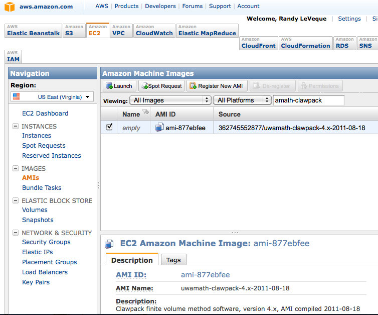
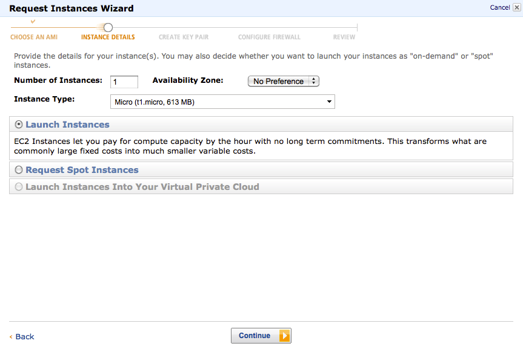
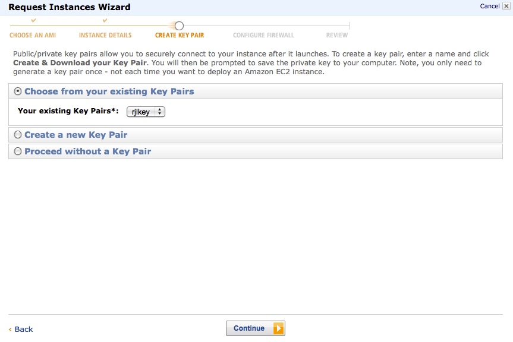
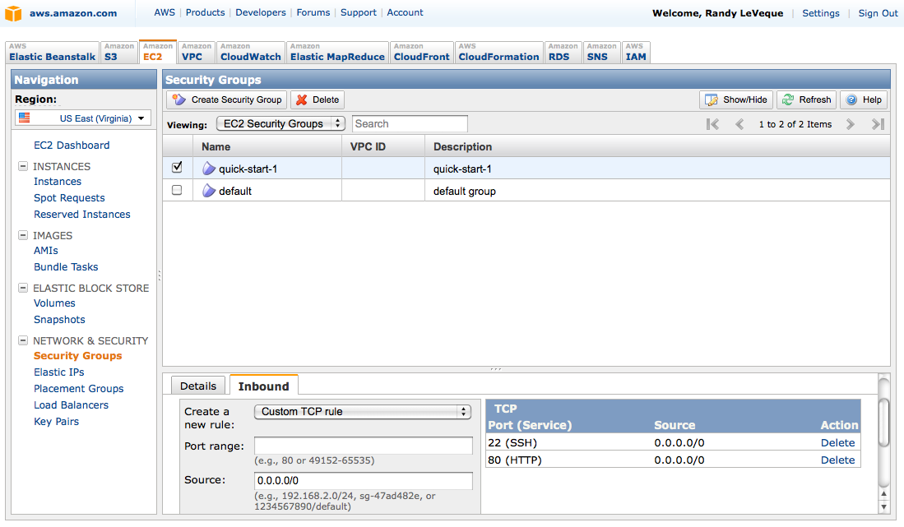
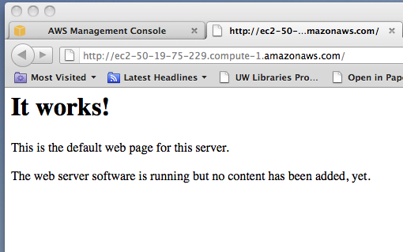

.. _aws:

Amazon Web Services EC2 Clawpack AMI
====================================

To run Clawpack in the Cloud using Amazon Web Services Elastic Cloud
Computing (EC2), first sign up for an account.  Note that 
you can get 750 hours free micro instance usage
(which may be sufficient for many things) in the
`free usage tier <http://aws.amazon.com/free/>`_.

For general information and a guide to getting started:

* `UW eScience information on AWS <http://escience.washington.edu/get-help-now/get-started-amazon-web-services>`_.

* `Getting started with EC2
  <http://docs.amazonwebservices.com/AWSEC2/latest/GettingStartedGuide/>`_,
  with tutorial to lead you through an example (a similar tutorial geared
  to Clawpack is included below).

* `EC2 FAQ <http://aws.amazon.com/ec2/faqs>`_.

* `Pricing <http://aws.amazon.com/ec2/#pricing>`_.  Note: you are charged
  per hour for hours (or fraction thereof) that your instance is in
  `running` mode, regardless of whether the CPU is being used.

Finding the Clawpack AMI
------------------------

Once you have an AWS account, sign in to the 
`management console <https://console.aws.amazon.com/ec2/>`_
and click on the
EC2 tab, and then select Region US East (which has cheaper rates) and click
on `AMIs` on the menu to the left.  

Change `Viewing:` to `All Images` and `All Platforms` and then *after* it
has finished loading the database start typing 
`uwamath-clawpack` in the search bar.  You
should find at least one AMI, as shown in this screen shapshot:

   
Launching an instance
---------------------

Select the Clawpack image and then
click on the `Launch` button on this page to start launching an instance 
based on this AMI.  This means a virtual machine will be started for you,
initialized with this disk image (which is a Ubuntu linux distribution with
Clawpack and its dependencies).

This should give a popup page that looks like this:

Here you can select what sort of instance you wish to start (larger
instances cost more per hour).

Click `Continue` on the next few screens and eventually you get to one that
looks like:

If you don't already have a key pair, create a new one and then
select this key pair here.

Click `Continue` and you will get a screen to set Security Groups.  Select
the `quick-start-1` option.  On the next screen click `Launch`.

Logging on to your instance
---------------------------

Click `Close` on the next page to
go back to the Management Console.  Click on `Instances` on the left menu
and you should see a list of instance you
have created, in your case only one.  If the status is not yet `running`
then wait until it is (click on the `Refresh` button if necessary).

*Click on the instance* and information about it should appear at the bottom
of the screen. Scroll down until you find the `Public DNS` information,
highlighted on the screenshot below:

.. image:: images/aws4.png
   :width: 15cm

Go into the directory where your key pair is stored, in a file with a name
like `rjlkey.pem` and you should be able to `ssh` into your instance using
the name of the public DNS, with format like::

    $ ssh -i KEYPAIR-FILE  ubuntu@DNS

where KEYPAIR-FILE and DNS must be replaced by the appropriate
things, e.g. for the above example::

    $ ssh -i rjlkey.pem ubuntu@ec2-50-19-75-229.compute-1.amazonaws.com

Note:

* You must include `-i keypair-file`

* You must log in as user ubuntu.

Using Clawpack
--------------

Once you have logged into your instance, you are on Ubuntu Linux that has
software needed for Clawpack pre-installed, including:

* gfortran
* Ipython, numpy, scipy, matplotlib
* make
* git
* netcdf
* apache web server

Other software is easily installed using `apt-get install`.

The current development version of Clawpack is installed in
`/claw/clawpack-4.x`.  If you want to use this version, you might want to::

    $ cd /claw/clawpack-4.x
    $ git fetch origin   # bring over any recent changes
    $ git merge origin/master  # merge them in
    $ python python/make_libs.py  # compile libraries

The `$CLAW` variable is set to point to this version of Clawpack (in the
`.bashrc` file).

Of course you could instead download a tar file of Clawpack and install
following the instructions at :ref:`installing`.  At any rate, see that
section for instructions on what to do next if you are new to Clawpack.

Viewing plots of results
------------------------

If you run Clawpack on your instance then you will probably want to view the
results.  There are at least three possible approaches (see :ref:`plotting`
for general information about plotting in Clawpack):

* If you are on a computer that supports X windows and you
  add the `-X` flag to your `ssh` command, then you should be able to
  plot interactively (see :ref:`plotting_Iplotclaw`).  
  Response may be pretty slow, however.

* If you create plots using ::

    $ make .plots

  then you will have a directory (named `_plots` by default) that contains
  `.png`
  figures and `.html` files for viewing them.  You can tar this directory up
  and transfer it to your local machine using `sftp`, and then view locally.

  Note that the plot files are often **much** smaller than the Fortran
  output files in `_output`, and so much quicker to transfer.  

* You can view the plots directly using a web browser as explained in the
  next section.

Viewing webpages directly from your instance
--------------------------------------------

If you use ::

    $ make .plots

to make a set of plot files and html files for viewing them, you can view
them directly by opening a web browser to an appropriate path on your
instance.  

The apache webserver should already be running, but to allow people to view
webpages you will need to adjust the security settings.  Go back to the
Management Console and click on `Security Groups` on the left menu.  Select
`quick-start-1` and then click on `Inbound`.  You should see a list of ports
that only lists 22 (SSH).  You want to add port 80 (HTTP).  Select HTTP from
the drop-down menu that says `Custom TCP Rule` and type 80 for the `Port
range`.  Then click `Apply Rule Changes`.  This should give something like
the next screen shot:

Now you should be able to point your browser to `http://DNS` where `DNS` is
replaced by the Public DNS name of your instance, the same as used for the
`ssh` command.  So for the example above, this would be ::

    `http://ec2-50-19-75-229.compute-1.amazonaws.com`.  

You should see this page:

The page being displayed can be found in `/var/www/index.html` on your
instance.  Any files you want to be visible on the web should be in
`/var/www`, or it is sufficient to have a link from this directory to where
they are located (created with the `ln -s` command in linux). 

So, for example, if you do the following::

    $ cd /var/www
    $ ln -s /claw/clawpack-4.x/apps ./apps

Then you should be able to see the `apps` directory in your web browser,
which would be at ::

    http://ec2-50-19-75-229.compute-1.amazonaws.com/apps/

for the above example.  You will have to replace the DNS with that of your
instance.   

If you want to expose all of your home directory to the web::

    $ cd /var/www
    $ ln -s /home/ubuntu ./home

Transferring files to/from your instance
----------------------------------------

You can use `scp` to transfer files between a running instance and
the computer on which the ssh key is stored.

From your computer (not from the instance)::

    $ scp -i KEYPAIR-FILE FILE-TO-SEND ubuntu@DNS:REMOTE-DIRECTORY

where DNS is the public DNS of the instance and `REMOTE-DIRECTORY` is
the path (relative to home directory) 
where you want the file to end up.  You can leave off
`:REMOTE-DIRECTORY` if you want it to end up in your home directory.

Going the other way, you can download a file from your instance to
your own computer via::

    $ scp -i KEYPAIR-FILE ubuntu@DNS:FILE-TO-GET .

to retrieve the file named `FILE-TO-GET` (which might include a path
relative to the home directory) into the current directory.

Stopping your instance
----------------------

Once you are done computing for the day, you will probably want to stop your
instance so you won't be charged while it's sitting idle.  You can do this
by selecting the instance from the Management Console / Instances, and then
select `Stop` from the `Instance Actions` menu.

You can restart it later and it will be in the same state you left it in.
But note that it will probably have a new Public DNS!

Creating your own AMI
---------------------

If you add additional software and want to save a disk image of your
improved virtual machine (e.g. in order to launch additional images in the
future to run multiple jobs at once), simply click on `Create Image (EBS
AMI)` from the `Instance Actions` menu.

